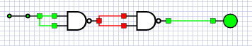
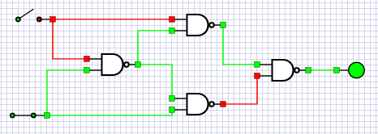
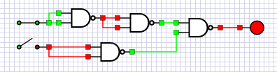

# Made by David Carl
## 

### Question 1

### Question 2
I made the different gates with NAND gates as the assignment told us to do,

This is the and gate

this is the or gate

this is the xor gate

this is the imply gate

