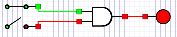
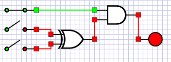
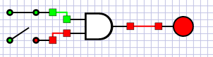

# Made by David Carl
## 

### Question 1
The diagrams is listed down below

This is **Commutative** diagram

This is **Distributive** diagram

This is **Identity** diagram

### Question 2
I made the different gates with NAND gates as the assignment told us to do,

This is the **and** gate

this is the **or** gate

this is the **xor** gate

this is the **imply** gate

