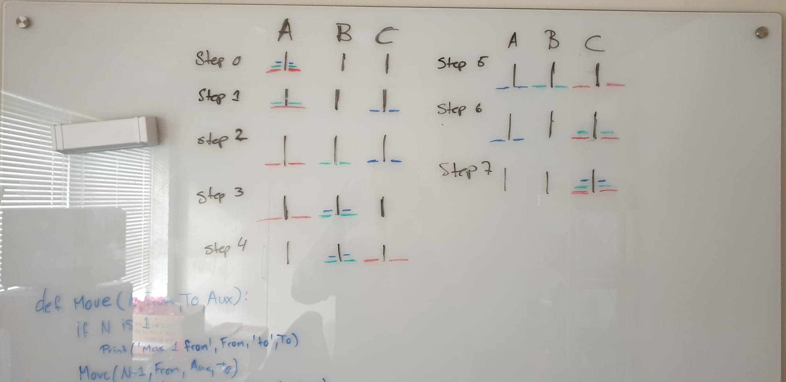

# Made by David Carl & Tjalfe Møller

### Tower of Hanoi

We created both a visual and text based way to solve this question.

Here is the visual 'guide' of how to solve it with 3 disks


And here is our text version of how to solve this puzzle.
```
Move disk 1 from A to C
Move disk 2 from A to B
Move disk 1 from C to B
Move disk 3 from A to C
Move disk 1 from B to A
Move disk 2 from B to C
Move disk 1 from A to C
```

And here is the code for it. It can also be found in [main.py](./main.py) in this repository!
```
n = 3 # Set amount of disk here

# n is number of disks
# f is from
# t is to
# a is auxiliary
def move(n, f, t, a):
    if n == 1:
        print('Move disk 1 from', f, 'to', t)
        return
    move(n-1, f, a, t)
    print('Move disk', n, 'from', f, 'to', t)
    move(n-1, a, t, f)

def towerOfHanoi():
    move(n, 'A', 'C', 'B')

towerOfHanoi()
```